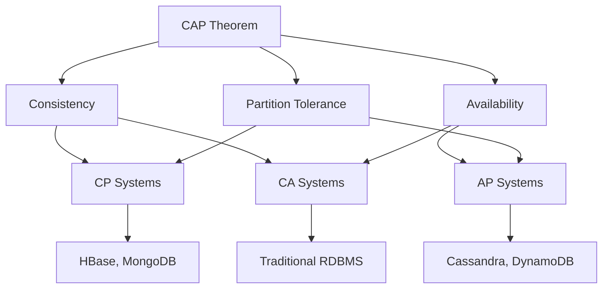

## Introduction

In the world of distributed systems, the CAP Theorem stands as one of the most fundamental concepts that every backend developer and system architect must understand. Proposed by Eric Brewer in 2000, this theorem defines the inherent trade-offs that distributed systems face when dealing with network failures and data consistency.

## What is the CAP Theorem?

The CAP Theorem states that a distributed system can only guarantee **two out of the following three properties** at the same time:

### 1. Consistency (C)
Every read receives the most recent write. All nodes in the system reflect the same data at any given time. When data is updated, all subsequent reads will return the updated value across all nodes.

### 2. Availability (A)
Every request receives a response (non-error), even if it may not contain the latest data. The system remains operational and responsive to client requests, regardless of individual node failures.

### 3. Partition Tolerance (P)
The system continues to operate despite network failures or communication loss between nodes. The system can handle network partitions where nodes cannot communicate with each other.

## The Fundamental Trade-offs

> **Important**: A distributed system cannot provide all three guarantees simultaneously. This is not a limitation of current technology but a fundamental constraint of distributed computing.
{: .prompt-warning }



In the presence of a network partition, a system must choose between:

### CP (Consistency + Partition Tolerance)
- **Behavior**: System maintains consistency and tolerates partitions but may sacrifice availability
- **Trade-off**: Some nodes may become unavailable during partitions
- **Examples**: HBase, MongoDB (with strong consistency), Redis Cluster
- **Use Cases**: Financial systems, inventory management, where data accuracy is critical

```java
// Example: Strong consistency in MongoDB
MongoCollection<Document> collection = database.getCollection("users");
collection.updateOne(
    eq("userId", "123"),
    set("balance", 1000),
    new UpdateOptions().writeConcern(WriteConcern.MAJORITY)
);
```

### AP (Availability + Partition Tolerance)
- **Behavior**: System remains available and partition-tolerant but may return stale data
- **Trade-off**: Temporary inconsistency across nodes
- **Examples**: Cassandra, DynamoDB, CouchDB
- **Use Cases**: Social media feeds, content delivery, where availability is more important than immediate consistency

```java
// Example: Eventual consistency in Cassandra
PreparedStatement statement = session.prepare(
    "UPDATE users SET balance = ? WHERE user_id = ? IF EXISTS"
);
session.execute(statement.bind(1000, "123"));
// Data will eventually be consistent across all nodes
```

### CA (Consistency + Availability)
- **Behavior**: System is consistent and available but cannot handle partitions
- **Reality**: Only achievable in systems without network partitions
- **Examples**: Traditional RDBMS on a single node, single-node applications
- **Limitation**: Not practical in real-world distributed environments

## Real-World Applications

### Banking Systems (CP)
```sql
-- Traditional banking requires strong consistency
BEGIN TRANSACTION;
UPDATE accounts SET balance = balance - 100 WHERE account_id = 'A001';
UPDATE accounts SET balance = balance + 100 WHERE account_id = 'A002';
COMMIT;
```

### Social Media Platforms (AP)
```javascript
// Social media can tolerate temporary inconsistency
// User posts may not appear immediately on all feeds
POST /api/posts
{
  "userId": "123",
  "content": "Hello World!",
  "timestamp": "2025-01-15T14:30:00Z"
}
```

## Beyond the CAP Theorem

### PACELC Theorem
The CAP theorem has been extended to PACELC, which states:
- **P**artition tolerance: If there's a partition, choose between **A**vailability and **C**onsistency
- **E**lse: If there's no partition, choose between **L**atency and **C**onsistency

### Practical Considerations

> **Pro Tip**: In most real-world scenarios, partition tolerance is required, so systems primarily trade off between consistency and availability.
{: .prompt-tip }

1. **Network partitions are inevitable** in distributed systems
2. **Consistency levels** can be tuned (eventual, strong, weak)
3. **Hybrid approaches** exist (different consistency for different data types)

## Implementation Strategies

### Eventual Consistency Patterns
```java
// Using versioning for conflict resolution
public class VersionedData {
    private String data;
    private long version;
    private long timestamp;
    
    // Vector clocks for distributed versioning
    private Map<String, Long> vectorClock;
}
```

### Consensus Algorithms
- **Raft**: Used in etcd, Consul
- **Paxos**: Used in Google's Chubby
- **PBFT**: For Byzantine fault tolerance

## Choosing the Right Approach

| System Type | Priority | CAP Choice | Examples |
|-------------|----------|------------|----------|
| Financial | Consistency | CP | Banking, Trading |
| Social Media | Availability | AP | Facebook, Twitter |
| E-commerce | Balanced | AP with eventual consistency | Amazon, eBay |
| Real-time Gaming | Low Latency | AP | Online games |

## Best Practices

1. **Understand your requirements**: Identify whether your system needs strong consistency or high availability
2. **Design for failure**: Assume network partitions will occur
3. **Monitor and measure**: Track consistency lag and availability metrics
4. **Use appropriate tools**: Choose databases and frameworks that align with your CAP choice
5. **Implement graceful degradation**: Have fallback mechanisms for partition scenarios

## Conclusion

The CAP Theorem is not just a theoretical concept but a practical guideline for designing distributed systems. Understanding these trade-offs helps architects make informed decisions about system design, database selection, and application architecture.

Remember, there's no "one size fits all" solution. The right choice depends on your specific use case, business requirements, and acceptable trade-offs.

## Further Reading

- [Brewer's CAP Theorem Paper](https://www.cs.berkeley.edu/~brewer/cs262b-2004/PODC-keynote.pdf)
- [Designing Data-Intensive Applications](https://dataintensive.net/)
- [MongoDB Consistency Documentation](https://docs.mongodb.com/manual/core/read-concern/)
- [Cassandra Consistency Levels](https://docs.datastax.com/en/cassandra-oss/3.0/cassandra/dml/dmlConfigConsistency.html)

---